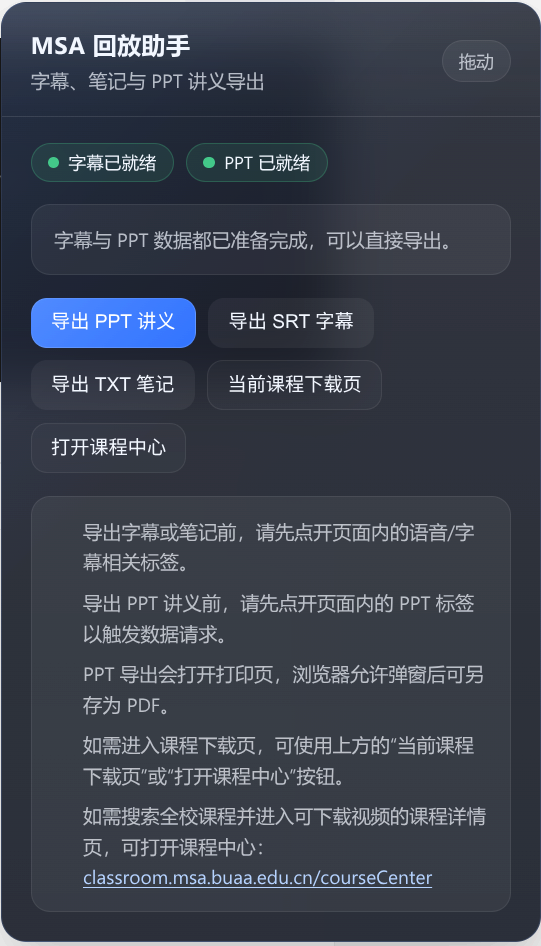
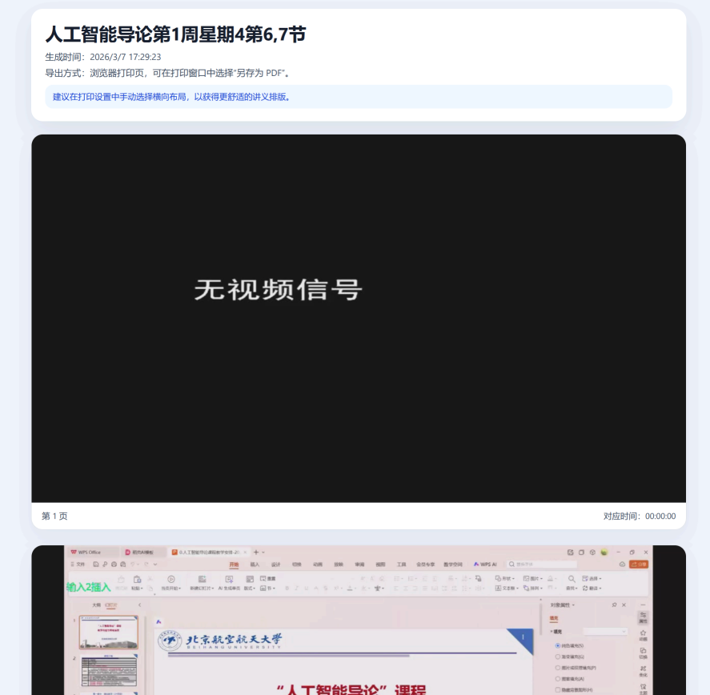
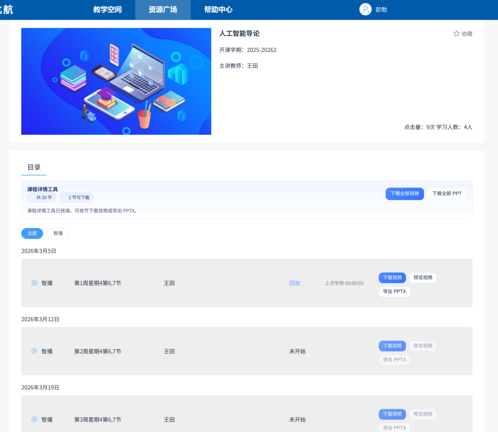
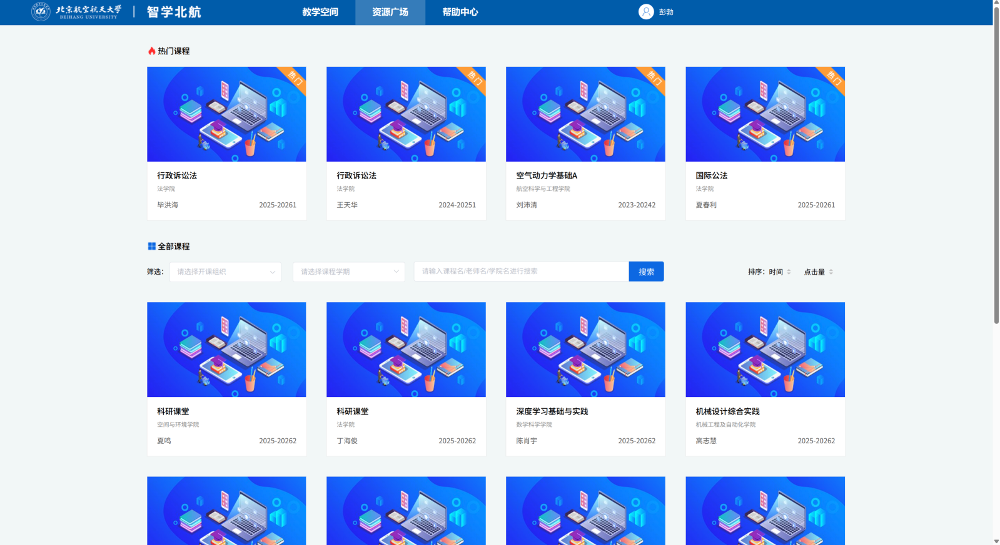

# 智学北航学习助手

原仓库：<https://github.com/peter-erer/buaa-spoc-helper> 感谢！

仓库地址：<https://github.com/Micraow/buaa-spoc-helper>

一个合并后的单 userscript，覆盖以下页面场景：

- `classroom.msa.buaa.edu.cn/livingroom*`
- `classroom.msa.buaa.edu.cn/coursedetail*`
- `spoc.buaa.edu.cn/*`

## 效果图

课程中心理论上可以下载往年所有课程

## 功能概览

### 1. MSA 回放页 `livingroom`

- 导出 SRT 字幕
- 导出 TXT 时间戳笔记
- 打开 PPT 讲义打印页，并可在浏览器打印窗口中选择“另存为 PDF”
- 悬浮面板显示字幕/PPT 是否已就绪

### 2. MSA 课程详情页 `coursedetail`

- 每节课就地显示：
  - 下载视频
  - 预览视频
  - 导出 PPTX
- 页面顶部提供：
  - 下载全部视频
  - 下载全部 PPT
- 可以先访问 `https://classroom.msa.buaa.edu.cn/courseCenter` 搜索全校课程，再进入对应课程详情页下载课程视频

### 3. SPOC 页面辅助

- 检测播放器是否就绪
- 显示视频时长与当前进度
- 倍速快捷按钮与自定义倍速输入 （播放器限制二倍速，更快的方式见我其他仓库）
- 自动下一节 （不可用）
- 视频链接查看 / 打开 / 复制
- 轻量日志面板

## 安装方法

1. 安装浏览器扩展 [Tampermonkey](https://www.tampermonkey.net/)。
2. 安装仓库中的 `buaa-spoc-helper.js`。
3. 确保浏览器允许 userscript 在目标站点运行。

## 使用说明

## 一、MSA 回放页：字幕 / 笔记 / PPT 讲义

适用页面：`classroom.msa.buaa.edu.cn/livingroom*`

进入页面后，右侧会出现一个可拖动的悬浮面板。

### 导出字幕或 TXT 笔记

1. 打开课程回放页。
2. 先点击页面内的“语音 / 字幕”相关标签，触发接口请求。
3. 当面板中“字幕已就绪”亮起后：
   - 点击“导出 SRT 字幕”可下载标准字幕文件。
   - 点击“导出 TXT 笔记”可下载带时间戳的笔记文件。

说明：TXT 笔记会沿用原脚本中的短句合并规则，把过短且时间间隔很近的语句合并在一起。

### 导出 PPT 讲义

1. 打开课程回放页。
2. 先点击页面内的 “PPT” 标签，触发 PPT 数据请求。
3. 当面板中“PPT 已就绪”亮起后，点击“导出 PPT 讲义”。
4. 如果你还没有进入目标课程，也可以直接点击面板里的“打开课程中心”，跳转到 `https://classroom.msa.buaa.edu.cn/courseCenter` 搜索全校课程；进入课程详情页后可下载课程视频。
5. 脚本会打开一个新的打印页，并预加载图片。
6. 加载完成后会自动唤起浏览器打印。
7. 在打印窗口中可选择：
   - 直接打印
   - 或选择“另存为 PDF”

注意：

- 这不是直接生成 PDF 文件，而是打开浏览器打印页。
- 如果浏览器拦截了弹窗，需要允许当前站点弹窗后重试。
- 为了获得更合适的讲义排版，建议在打印设置中手动选择横向布局。

## 二、MSA 课程详情页：视频 / PPTX 下载

适用页面：`classroom.msa.buaa.edu.cn/coursedetail*`

进入课程详情页后：

- 页面顶部会出现一个工具条。
- 每一节课程标题下方会出现一组就地操作按钮。

### 单节操作

每节课支持：

- **下载视频**：根据该节课程的可用视频流生成下载。
- **预览视频**：打开独立预览页查看该节视频流。
- **导出 PPTX**：把该节的 PPT 图片打包为 `.pptx` 文件。

### 批量操作

页面顶部工具条支持：

- **下载全部视频**
- **下载全部 PPT**

说明：

- 某些课程如果平台状态不是可用状态，会显示为不可点击。
- 批量操作会连续触发多个下载，浏览器可能弹出多个下载确认。
- PPTX 导出依赖 `PptxGenJS`。
- 视频预览通过新页面打开，不再依赖额外的前端框架资源。
- 若你还没进入目标课程，可先访问 `https://classroom.msa.buaa.edu.cn/courseCenter` 搜索全校课程，再进入相应课程详情页使用下载功能。

## 三、SPOC 页面辅助

适用页面：`spoc.buaa.edu.cn/*`

进入页面后，脚本会尝试检测当前页面中的 `<video>` 播放器，并显示一个统一风格的悬浮面板。

### 支持的辅助能力

- **状态与时长**
  - 检测是否找到播放器
  - 显示视频总时长
  - 显示当前播放位置与进度条

- **倍速快捷**
  - 提供常用倍速按钮：`1x`、`1.25x`、`1.5x`、`2x`
  - 支持手动输入并应用自定义倍速

- **自动下一节**
  - 开关式启用
  - 当当前视频播放结束后，尝试查找页面中的“下一节 / 下一课 / next”类入口并点击
  - 如果找不到，会在日志中给出提示

- **视频链接工具**
  - 如果页面能读取到 `video.currentSrc` / `source.src`
  - 则可直接打开或复制当前视频链接

- **日志面板**
  - 显示播放器检测、倍速设置、自动下一节结果等状态信息

## 注意事项

- 脚本会按页面自动切换功能，不同页面出现的 UI 不同。
- `livingroom` 页面使用悬浮面板。
- `coursedetail` 页面保留就地按钮，并增加顶部工具条。
- 某些页面结构如果发生变化，按钮插入位置或“下一节”识别规则可能需要跟着调整。
- 若浏览器或站点策略阻止弹窗、下载或剪贴板访问，部分功能会受到影响。

## 文件说明

- `buaa-spoc-helper.js`：合并后的主脚本
- `autoplay.js`：历史参考脚本
- `msa-download.js`：历史参考脚本

## License

本项目基于 [MIT License](./LICENSE) 开源。
